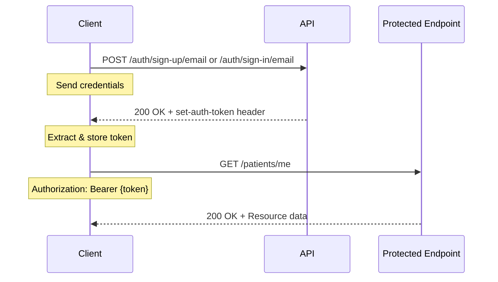
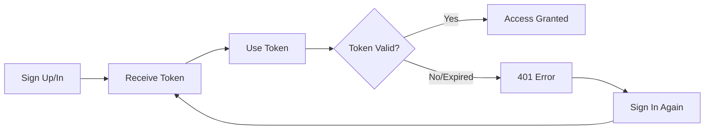

# API Authentication Guide

This guide is for developers integrating with the Monobase Rust API. We use Bearer token authentication for secure API access.

## Overview

The Monobase Rust API uses **Bearer token authentication**. Tokens are cryptographically signed (HMAC-SHA256) and must be included in the `Authorization` header of protected endpoints.

**Implementation note**: Unlike the TypeScript service which uses the Better-Auth JS library at runtime, the Rust service reads the Better-Auth database tables directly and performs HMAC-SHA256 signature verification natively using the `hmac`, `sha2`, and `base64` crates.

## Authentication Flow



## Quick Start

### Step 1: Sign Up (New Users)

```bash
curl -X POST http://localhost:7213/auth/sign-up/email \
  -H "Content-Type: application/json" \
  -d '{
    "email": "user@example.com",
    "password": "securepass123",
    "name": "John Doe"
  }' -i
```

**Response Headers:**
```http
HTTP/1.1 200 OK
set-auth-token: eNAnB5w0vD3x3TikNuCU5gPLVg3egR4g.qvb4RbVVp9ctwJb%2FBzevcQJBvXTLNGb6zu%2FzB9%2Bqva8%3D
```

### Step 2: Sign In (Existing Users)

```bash
curl -X POST http://localhost:7213/auth/sign-in/email \
  -H "Content-Type: application/json" \
  -d '{
    "email": "user@example.com",
    "password": "securepass123"
  }' -i
```

### Step 3: Extract Token

Look for the `set-auth-token` header in the response. This is your authentication token.

```bash
# Example: Extract token from response
TOKEN="eNAnB5w0vD3x3TikNuCU5gPLVg3egR4g.qvb4RbVVp9ctwJb%2FBzevcQJBvXTLNGb6zu%2FzB9%2Bqva8%3D"
```

### Step 4: Use Token for Protected Endpoints

Include the token in the `Authorization` header with the `Bearer` prefix:

```bash
curl -X GET http://localhost:7213/patients/me \
  -H "Authorization: Bearer $TOKEN"
```

## Token Format

```
┌─────────────────────────────────────────────────────────────┐
│                         Bearer Token                         │
├──────────────────────┬───────────────────────────────────────┤
│      Session ID      │        URL-Encoded Signature         │
├──────────────────────┼───────────────────────────────────────┤
│   32 characters      │            ~64 characters             │
└──────────────────────┴───────────────────────────────────────┘

Example: eNAnB5w0vD3x3TikNuCU5gPLVg3egR4g.qvb4RbVVp9ctwJb%2FBzevcQJBvXTLNGb6zu%2FzB9%2Bqva8%3D
         └────────── Session ID ──────────┘ └───────── Signature (URL-encoded) ─────────┘
```

⚠️ **IMPORTANT**: Keep the URL encoding intact! Do NOT decode `%2F`, `%3D`, etc.

## Session Verification (Rust Implementation)

Location: `src/auth/session.rs`

### Token Signature Verification

The token is a Better-Auth compatible signed cookie. The Rust service verifies it using HMAC-SHA256:

```rust
/// Format: `{raw_token}.{base64_hmac_signature}`
/// The cookie value may be URL-encoded.
pub fn verify_signed_token(cookie_value: &str, secret: &str) -> Result<String, ApiError> {
    let decoded = urlencoding::decode(cookie_value)
        .map_err(|_| ApiError::unauthorized("Invalid token encoding"))?;

    // Split on last '.' to get raw_token and signature
    let last_dot = decoded.rfind('.')
        .ok_or_else(|| ApiError::unauthorized("Invalid token format"))?;

    let raw_token = &decoded[..last_dot];
    let signature = &decoded[last_dot + 1..];

    // Verify HMAC-SHA256
    let mut mac = HmacSha256::new_from_slice(secret.as_bytes())
        .map_err(|_| ApiError::internal("HMAC key error"))?;
    mac.update(raw_token.as_bytes());
    let expected = BASE64.encode(mac.finalize().into_bytes());

    if signature != expected {
        return Err(ApiError::unauthorized("Invalid token signature"));
    }

    Ok(raw_token.to_string())
}
```

### Session Lookup

After signature verification, the raw token is looked up in the Better-Auth `session` table:

```rust
pub async fn get_user_by_token(
    db: &DatabaseConnection,
    token: &str,
) -> Result<Option<AuthUser>, ApiError> {
    let sql = r#"
        SELECT
            u.id, u.name, u.email, u.email_verified, u.image,
            u.role, u.banned, u.ban_reason, u.ban_expires,
            u.two_factor_enabled,
            s.expires_at
        FROM "session" s
        JOIN "user" u ON u.id = s.user_id
        WHERE s.token = $1
    "#;
    // ...
}
```

The function also:
- Checks `s.expires_at` against `chrono::Utc::now()` — expired sessions return `None`
- Checks `u.banned` and `u.ban_expires` — permanently banned accounts return `ApiError::forbidden`

### AuthUser Extractor

Protected handlers receive the authenticated user via the `AuthUser` Axum extractor (defined in `src/middleware/auth.rs`):

```rust
pub async fn get_patient(
    State(ctx): State<AppContext>,
    AuthUser(user): AuthUser,      // Returns 401 if token invalid/missing
    Path(patient_id): Path<Uuid>,
) -> Result<Json<PatientResponse>, ApiError> {
    // user.id, user.email, user.roles are available here
}
```

### Bearer Token Extraction

The extractor accepts both signed and unsigned tokens from the `Authorization` header:

```rust
pub fn extract_bearer_token(auth_header: &str, secret: &str) -> Result<String, ApiError> {
    let token = auth_header
        .strip_prefix("Bearer ")
        .ok_or_else(|| ApiError::unauthorized("Invalid authorization header"))?;

    // If token contains a '.', it's a signed token — verify it
    if token.contains('.') {
        verify_signed_token(token, secret)
    } else {
        Ok(token.to_string())
    }
}
```

### Password Verification

Sign-in uses the `bcrypt` crate to verify the `password` column in the Better-Auth `account` table:

```rust
// src/auth/password.rs
bcrypt::verify(plaintext_password, hashed_password)?
```

### Session Creation

On sign-up/sign-in, the service creates a row in the Better-Auth `session` table and signs the token:

```rust
pub async fn create_session(
    db: &DatabaseConnection,
    user_id: &str,
    expires_secs: u64,
    ip_address: Option<&str>,
    user_agent: Option<&str>,
) -> Result<String, ApiError>   // Returns the signed token

pub fn sign_token(raw_token: &str, secret: &str) -> Result<String, ApiError>
```

## Common API Patterns

### Public Endpoints (No Authentication)
```bash
# Readiness check (simple text response)
curl http://localhost:7213/readyz
# Response: "ok" (healthy) or "failed" (unhealthy)

# Readiness check (verbose JSON response)
curl "http://localhost:7213/readyz?verbose"
# Response: {"status":"pass","timestamp":"...","checks":{...}}

# Liveness check
curl http://localhost:7213/livez
# Response: "ok"
```

### Protected Endpoints (Authentication Required)
```bash
# Get current user's patient profile
curl -H "Authorization: Bearer $TOKEN" http://localhost:7213/patients/me

# Create a patient profile
curl -X POST http://localhost:7213/patients \
  -H "Authorization: Bearer $TOKEN" \
  -H "Content-Type: application/json" \
  -d '{"person": {"firstName": "Jane", "lastName": "Doe"}}'
```

## Complete Working Example

```bash
#!/bin/bash

# 1. Sign in and capture the full response
RESPONSE=$(curl -X POST http://localhost:7213/auth/sign-in/email \
  -H "Content-Type: application/json" \
  -d '{"email": "test@example.com", "password": "password123"}' \
  -s -i)

# 2. Extract the token from set-auth-token header (keep URL encoding!)
TOKEN=$(echo "$RESPONSE" | grep -i "set-auth-token" | cut -d' ' -f2 | tr -d '\r')

# 3. Use the token to access protected endpoints
curl -X GET http://localhost:7213/patients/me \
  -H "Authorization: Bearer $TOKEN" \
  -s | jq
```

## Error Handling

| Status Code | Error | Solution |
|------------|-------|----------|
| **401 Unauthorized** | Missing or invalid token | Check token is included in `Authorization: Bearer {token}` header |
| **401 Unauthorized** | Token expired | Sign in again to get a new token |
| **401 Unauthorized** | Invalid signature | Ensure the URL-encoded token is sent as-is, without decoding |
| **403 Forbidden** | Insufficient permissions | User lacks required role/permission for this endpoint |
| **403 Forbidden** | Account is banned | Contact support |
| **400 Bad Request** | Invalid request body | Check request payload matches API schema |

### Debugging Authentication Issues

```bash
# Verbose output to see headers
curl -v -X GET http://localhost:7213/patients/me \
  -H "Authorization: Bearer $TOKEN"

# Common issues:
# 1. Missing "Bearer " prefix
# 2. Token has been URL-decoded (breaking the HMAC signature)
# 3. Token has expired (default: 7 days)
# 4. Extra whitespace in token
# 5. AUTH_SECRET mismatch between sign-in and validation
```

## Token Lifecycle



## Security Notes

- **Token Expiration**: Tokens expire after 7 days by default — configurable via `AUTH_SESSION_EXPIRES_IN`
- **HMAC-SHA256 Signatures**: Tokens are signed using the `AUTH_SECRET` environment variable
- **bcrypt Passwords**: Passwords are hashed with bcrypt (cost factor from Better-Auth defaults)
- **HTTPS Required**: Always use HTTPS in production to protect tokens in transit
- **Token Storage**: Store tokens securely — never log them or store in plain text

## Configuration

Environment variables (parsed by clap into `Config`):

```bash
AUTH_SECRET=change-me-in-production       # HMAC signing key
AUTH_SESSION_EXPIRES_IN=604800            # 7 days in seconds
AUTH_ADMIN_EMAILS=admin@example.com       # Comma-separated admin email list
```

## Additional Resources

- **OpenAPI Specification**: `GET /docs/openapi.json`
- **Session implementation**: `src/auth/session.rs`
- **Password helpers**: `src/auth/password.rs`
- **Auth handlers**: `src/handlers/auth.rs`
- **AuthUser extractor**: `src/middleware/auth.rs`

## Support

For authentication issues:
1. Verify token format and encoding
2. Check token hasn't expired
3. Ensure proper `Authorization` header format
4. Verify `AUTH_SECRET` matches across all running instances
5. Review server logs (`RUST_LOG=debug cargo run`) for detailed error messages
