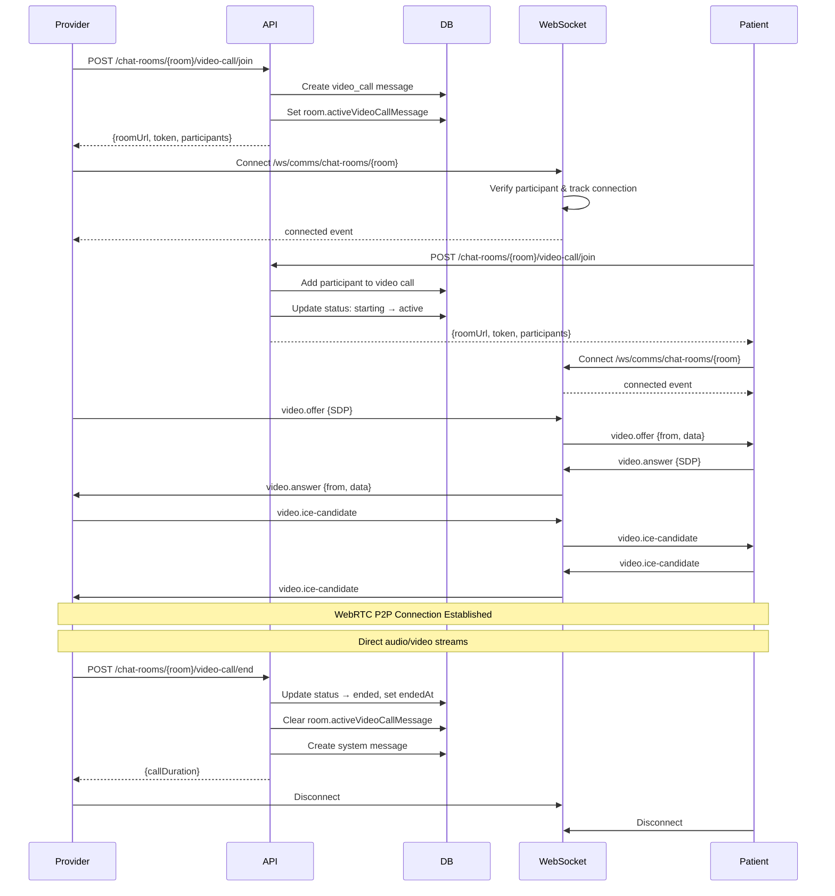
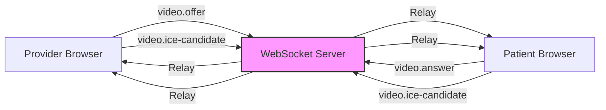
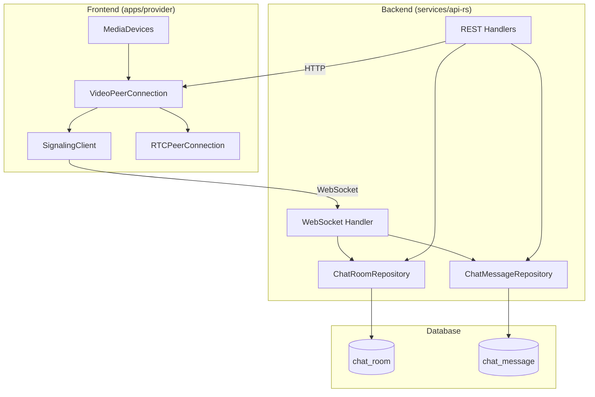

# Video Call Implementation

## Overview

WebRTC-based video consultation system using browser native APIs with self-hosted WebSocket signaling. Supports 1-on-1 video calls between patients and providers with integrated chat functionality.

**Architecture:**
- Browser native WebRTC (RTCPeerConnection)
- Self-hosted WebSocket signaling (Axum + `WebSocketService`)
- Configurable STUN/TURN servers via `WEBRTC_ICE_SERVERS` environment variable
- Database-backed call state management (SeaORM)
- P2P direct audio/video streams

---

## Architecture

### Video Call Lifecycle



### WebSocket Signaling Flow



### Component Architecture



---

## WebSocket API

### Endpoint

```
GET /ws/comms/chat-rooms/:room
```

**Authentication:** Required (session token via `AuthUser` extractor)
**Authorization:** User must be participant in chat room

### Connection Lifecycle

**onConnect (Axum `on_upgrade` callback):**
- Verify room exists (SeaORM query)
- Verify user is participant (via patient/provider profiles)
- Subscribe to channel: `chat-rooms/{roomId}` via `WebSocketService::subscribe_channel`
- Send `connected` event to client
- Publish `user.joined` event to channel (excluding sender)

**Message loop:**
- Parse JSON message with `{type, data}`
- Route based on message type
- Relay signaling messages to channel participants via `WebSocketService::publish_to_channel`

**onClose (socket stream exhausted):**
- Unsubscribe from channel
- Publish `user.left` event to channel

### Message Types

#### 1. Video Signaling Messages

**video.offer**
```json
{ "type": "video.offer", "data": "<RTCSessionDescriptionInit>" }
```
Relayed as:
```json
{ "type": "video.offer", "from": "<userId>", "data": "<RTCSessionDescriptionInit>" }
```

**video.answer**
```json
{ "type": "video.answer", "data": "<RTCSessionDescriptionInit>" }
```
Relayed as:
```json
{ "type": "video.answer", "from": "<userId>", "data": "<RTCSessionDescriptionInit>" }
```

**video.ice-candidate**
```json
{ "type": "video.ice-candidate", "data": "<RTCIceCandidateInit>" }
```
Relayed as:
```json
{ "type": "video.ice-candidate", "from": "<userId>", "data": "<RTCIceCandidateInit>" }
```

#### 2. Chat Messages

**chat.message**
```json
{ "type": "chat.message", "data": { "text": "string (max 5000 chars)" } }
```
- Persisted to database via `ChatMessageRepository`
- Full message object broadcast to channel

**chat.typing**
```json
{ "type": "chat.typing", "data": { "isTyping": true } }
```
- Not persisted
- Relayed to channel participants

#### 3. Heartbeat

**ping**
```json
{ "type": "ping" }
```
Response:
```json
{ "event": "pong", "payload": { "timestamp": "<ISO 8601>" } }
```

### Server Events

**connected**
```json
{ "event": "connected", "payload": { "roomId": "string", "userId": "string", "timestamp": "string" } }
```

**user.joined**
```json
{ "event": "user.joined", "payload": { "userId": "string", "timestamp": "string" } }
```

**user.left**
```json
{ "event": "user.left", "payload": { "userId": "string", "timestamp": "string" } }
```

**error**
```json
{ "event": "error", "payload": { "message": "string" } }
```

---

## REST API Endpoints

### Get ICE Servers

```
GET /comms/ice-servers
```

**Authentication:** Not required
**Response:** 200 OK

```json
{
  "iceServers": [
    { "urls": "stun:stun.l.google.com:19302" },
    { "urls": "stun:stun1.l.google.com:19302" }
  ]
}
```

**Configuration:**
- `WEBRTC_ICE_SERVERS` env variable — comma-separated list of STUN/TURN URLs (parsed by clap into `Vec<String>`)
- Default: two Google public STUN servers

---

### Join Video Call

```
POST /comms/chat-rooms/{room}/video-call/join
```

**Authentication:** Required
**Authorization:** User must be participant in chat room

**Request Body:**
```json
{
  "displayName": "string",
  "audioEnabled": true,
  "videoEnabled": true
}
```

**Response:** 200 OK
```json
{
  "roomUrl": "ws://localhost:7213/ws/comms/chat-rooms/{roomId}",
  "token": "USE_SESSION_TOKEN",
  "callStatus": "starting | active",
  "participants": [
    {
      "user": "string",
      "userType": "patient | provider",
      "displayName": "string",
      "joinedAt": "string",
      "leftAt": null,
      "audioEnabled": true,
      "videoEnabled": true
    }
  ]
}
```

**Behavior:**
- First participant creates video call message (status: "starting")
- Second participant updates status to "active"
- Subsequent participants join active call
- Rejects if user already in call (409 Conflict)
- Creates system message: "{displayName} joined the video call"

---

### End Video Call

```
POST /comms/chat-rooms/{room}/video-call/end
```

**Authentication:** Required
**Authorization:** User must be room admin

**Response:** 200 OK
```json
{
  "message": "string",
  "callDuration": 12,
  "systemMessage": {}
}
```

**Behavior:**
- Calculates duration from `startedAt` to `endedAt`
- Updates video call status to "ended"
- Clears `room.activeVideoCallMessage` reference
- Creates system message: "Video call ended by {name} ({duration} minutes)"
- Only room admins can end calls

---

### Leave Video Call

```
POST /comms/chat-rooms/{room}/video-call/leave
```

**Authentication:** Required
**Authorization:** User must be participant in call

**Response:** 200 OK
```json
{
  "message": "string",
  "callStillActive": true,
  "remainingParticipants": 1
}
```

**Behavior:**
- Marks `participant.leftAt` timestamp
- Creates system message: "{displayName} left the video call"
- If no participants remain:
  - Auto-ends call (status: "ended")
  - Clears `room.activeVideoCallMessage`
  - Creates system message: "Video call ended (no participants remaining)"

---

### Update Participant

```
PATCH /comms/chat-rooms/{room}/video-call/participant
```

**Authentication:** Required
**Authorization:** User must be participant in call

**Request Body:**
```json
{
  "audioEnabled": true,
  "videoEnabled": false
}
```

**Response:** 200 OK — updated participant object

**Behavior:**
- Updates participant's audio/video status in database (SeaORM update)
- Does NOT send WebSocket notification (client manages local state)

---

## Database Schema

### chat_room Table

```sql
CREATE TABLE chat_room (
  -- Base fields (id, created_at, updated_at, etc.)
  participants JSONB NOT NULL,           -- Array of participant IDs
  admins JSONB NOT NULL,                 -- Array of admin IDs
  context_id UUID,                       -- Generic reference (appointment, etc.)
  status chat_room_status NOT NULL DEFAULT 'active',
  last_message_at TIMESTAMP,
  message_count INTEGER NOT NULL DEFAULT 0,
  active_video_call_message_id UUID     -- Current active call
);
```

**Indexes:**
- GIN index on `participants` and `admins` (JSONB arrays)
- B-tree on `context_id`, `status`, `last_message_at`
- B-tree on `active_video_call_message_id`

### chat_message Table

```sql
CREATE TABLE chat_message (
  -- Base fields (id, created_at, updated_at, etc.)
  chat_room_id UUID NOT NULL REFERENCES chat_room(id),
  sender_id UUID NOT NULL,
  timestamp TIMESTAMP NOT NULL DEFAULT NOW(),
  message_type message_type NOT NULL,    -- 'text' | 'system' | 'video_call'
  message TEXT,                          -- For text/system messages
  video_call_data JSONB                  -- For video_call messages
);
```

**Indexes:**
- B-tree on `chat_room_id`, `sender_id`, `timestamp`, `message_type`
- Compound: (chat_room_id, timestamp)
- Compound: (chat_room_id, message_type)

### Video Call Data Structure (JSONB)

```json
{
  "status": "starting | active | ended | cancelled",
  "roomUrl": "string",
  "startedAt": "ISO 8601",
  "endedAt": "ISO 8601",
  "durationMinutes": 12,
  "participants": [
    {
      "user": "string",
      "userType": "patient | provider",
      "displayName": "string",
      "joinedAt": "ISO 8601",
      "leftAt": null,
      "audioEnabled": true,
      "videoEnabled": true
    }
  ]
}
```

---

## Call Flow

### Starting a Call

1. **Provider initiates call:**
   - Frontend: `POST /comms/chat-rooms/{room}/video-call/join`
   - Backend creates `video_call` message with status "starting"
   - Backend sets `room.activeVideoCallMessage = message.id`
   - Response includes WebSocket URL and participant list

2. **Provider connects to WebSocket:**
   - Frontend: Connect to `ws://.../ws/comms/chat-rooms/{room}`
   - Axum upgrade handler validates participant, subscribes to channel
   - Server sends `connected` event

3. **Provider requests media:**
   - Frontend: `navigator.mediaDevices.getUserMedia()`
   - Creates `RTCPeerConnection` with ICE servers from `GET /comms/ice-servers`

4. **Patient joins call:**
   - Frontend: `POST /comms/chat-rooms/{room}/video-call/join`
   - Backend adds participant to existing call
   - Backend updates status: "starting" → "active"

5. **Patient connects to WebSocket:**
   - Frontend: Connect to same WebSocket channel
   - Backend validates participant, subscribes to channel

6. **WebRTC negotiation:**
   - Provider creates SDP offer → sends via `video.offer` message
   - Server relays to patient via `WebSocketService::publish_to_channel`
   - Patient creates SDP answer → sends via `video.answer` message
   - Server relays to provider
   - Both exchange ICE candidates via `video.ice-candidate` messages

7. **P2P connection established:**
   - Direct audio/video streams between browsers
   - Server only relays signaling (no media)

### During Call

**Audio/Video Controls:**
- Frontend toggles `MediaStreamTrack.enabled` property
- Frontend calls `PATCH /comms/chat-rooms/{room}/video-call/participant`
- Updates persisted in database for call history

**Screen Sharing:**
- Frontend: `navigator.mediaDevices.getDisplayMedia()`
- Frontend calls `RTCRtpSender.replaceTrack()` to swap video track
- No backend involvement (pure WebRTC)

**Chat Messages:**
- Send via WebSocket: `{type: 'chat.message', data: {text}}`
- Server persists to database via `ChatMessageRepository`
- Server broadcasts to all channel participants

### Ending Call

**Admin ends call:**
- Frontend: `POST /comms/chat-rooms/{room}/video-call/end`
- Backend calculates duration
- Backend sets status "ended", clears `room.activeVideoCallMessage`
- Frontend closes `RTCPeerConnection` and WebSocket
- Frontend stops all media tracks

**Participant leaves:**
- Frontend: `POST /comms/chat-rooms/{room}/video-call/leave`
- Backend marks `participant.leftAt` timestamp
- If last participant: auto-end call
- Frontend closes connections and stops media

---

## Configuration

### Environment Variables

**WEBRTC_ICE_SERVERS**

Comma-separated list of STUN/TURN server URLs (parsed by clap):

```bash
WEBRTC_ICE_SERVERS=stun:stun.l.google.com:19302,stun:stun1.l.google.com:19302
```

To include TURN servers, configure via the env variable:

```bash
WEBRTC_ICE_SERVERS=stun:stun.l.google.com:19302,turn:turn.example.com:3478
```

**Default** (if not set):
```
stun:stun.l.google.com:19302
stun:stun1.l.google.com:19302
```

### Code Reference

Configuration in `src/config.rs`:
```rust
#[arg(
    long,
    env = "WEBRTC_ICE_SERVERS",
    default_value = "stun:stun.l.google.com:19302,stun:stun1.l.google.com:19302",
    value_delimiter = ','
)]
pub webrtc_ice_servers: Vec<String>,
```

---

## Implementation Files

### Backend
- **WebSocket Handler:** `src/handlers/comms/mod.rs`
- **REST Handlers** (within `src/handlers/comms/mod.rs`):
  - `get_ice_servers`
  - `join_video_call`
  - `end_video_call`
  - `leave_video_call`
  - `update_video_call_participant`
- **Repositories:** `src/handlers/comms/repo.rs`
- **WebSocket Service:** `src/service/ws.rs`

### Frontend (apps/provider)
- **WebRTC Client:** `src/lib/webrtc/peer-connection.ts`
- **Signaling Client:** `src/lib/webrtc/signaling-client.ts`
- **Media Devices:** `src/lib/webrtc/media-devices.ts`
- **API Client:** `src/api/comms.ts`

---

## Client Integration

### Authentication

**Session Token:**
- Clients extract session token from cookies (Better-Auth compatible `set-auth-token` header)
- Token sent via `Authorization: Bearer {token}` header
- Axum's `AuthUser` extractor validates the token before upgrading the WebSocket
- Frontend token extraction:
  ```javascript
  const sessionToken = document.cookie
    .split('; ')
    .find(row => row.startsWith('better-auth.session_token='))
    ?.split('=')[1]
  ```

**Connection Flow:**
1. Client calls REST API to join video call
2. API returns WebSocket URL
3. Client connects with `Authorization: Bearer {session_token}`
4. Server validates participant and subscribes to broadcast channel

### WebSocket Client Behavior

**Connection Management:**
- Auto-reconnection with exponential backoff (max 5 attempts)
- Heartbeat via `ping`/`pong` messages
- State tracking: connecting → open → closed/error

**Message Handling:**
- Parse all messages as JSON
- Route based on `event` or `type` field
- Handle connection events: `connected`, `user.joined`, `user.left`
- Handle signaling: `video.offer`, `video.answer`, `video.ice-candidate`
- Handle chat: `chat.message`, `chat.typing`

### WebRTC Client Implementation

**RTCPeerConnection Setup:**
```javascript
const { iceServers } = await fetch('/comms/ice-servers').then(r => r.json())
const pc = new RTCPeerConnection({ iceServers })
```

**Media Stream:**
```javascript
const stream = await navigator.mediaDevices.getUserMedia({
  audio: true,
  video: { width: 1280, height: 720 }
})
stream.getTracks().forEach(track => pc.addTrack(track, stream))
```

**Signaling:**
- Initiator creates offer → sends via `video.offer` message
- Receiver creates answer → sends via `video.answer` message
- Both exchange ICE candidates via `video.ice-candidate` messages

**Screen Sharing:**
```javascript
const displayStream = await navigator.mediaDevices.getDisplayMedia({
  video: { cursor: 'always' },
  audio: false
})
const videoTrack = displayStream.getVideoTracks()[0]
const sender = pc.getSenders().find(s => s.track?.kind === 'video')
await sender.replaceTrack(videoTrack)
```

### Browser Requirements

**Minimum Versions:**
- Chrome 56+ (released 2017)
- Firefox 44+ (released 2016)
- Safari 11+ (released 2017)
- Edge 79+ (Chromium-based)

**Required APIs:**
- `RTCPeerConnection`
- `getUserMedia()`
- `getDisplayMedia()` (for screen sharing)
- `WebSocket`

**Mobile Support:**
- iOS Safari 11+
- Chrome for Android 56+
- May require UX adjustments for small screens

### Network Requirements

**STUN Servers:**
- Required for NAT traversal
- Default: Google public STUN servers
- Works on most networks

**TURN Servers:**
- NOT configured by default
- Required for very restrictive firewalls/networks
- Add via `WEBRTC_ICE_SERVERS` environment variable

**Ports:**
- WebSocket: 7213 (development) or 443 (production wss://)
- WebRTC: Dynamic UDP ports (managed by browser)
- Firewall must allow UDP traffic for P2P connection

---

## Security

**Transport Encryption:**
- WebRTC uses DTLS-SRTP for end-to-end media encryption
- WebSocket signaling over TLS in production (wss://)
- No third-party servers access media streams

**Authentication:**
- All WebSocket connections validated by `AuthUser` Axum extractor before upgrade
- REST endpoints require authentication via `AuthUser`

**Authorization:**
- WebSocket: Verify user is participant before subscribing to channel
- Join call: Verify user is participant in chat room
- End call: Only room admins can end calls
- Leave call: Only current participants can leave
- Update participant: Only current participants can update their status

**Input Validation:**
- Display name required (trimmed, validated with `garde`)
- Chat messages limited to 5000 characters
- WebSocket messages must be valid JSON (parse errors return an `error` event)

**Data Isolation:**
- Broadcast channels namespaced: `chat-rooms/{roomId}`
- Messages only relayed to subscribers of the same channel
- Database queries filtered by participant authorization

**Compliance:**
- HIPAA-compliant (self-hosted, no external video services)
- Direct P2P media (backend never sees media streams)
- Audit trail in database (join/leave timestamps, call duration)
